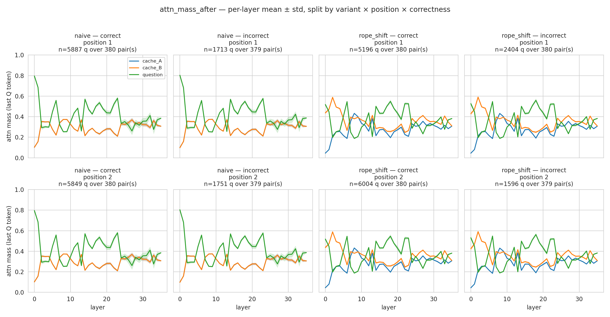
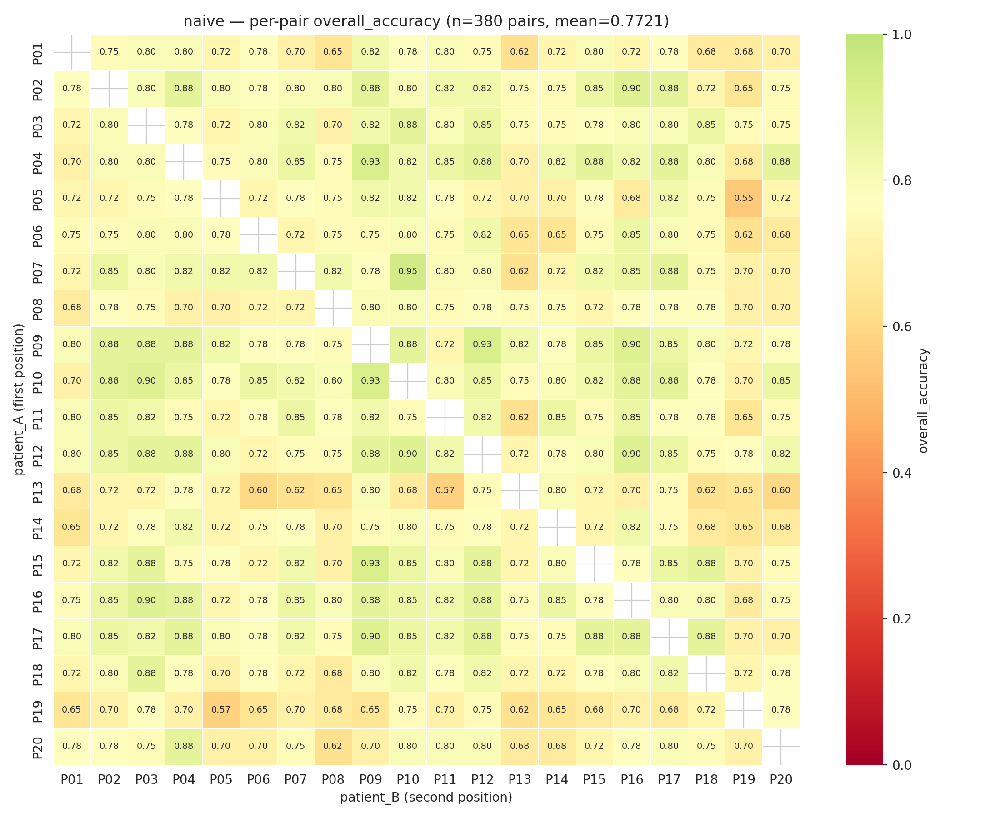
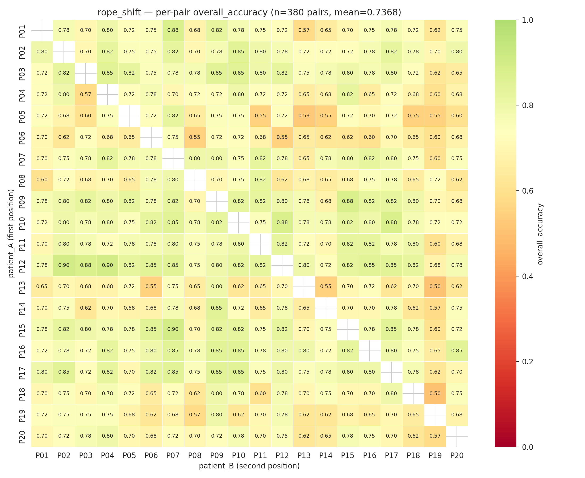
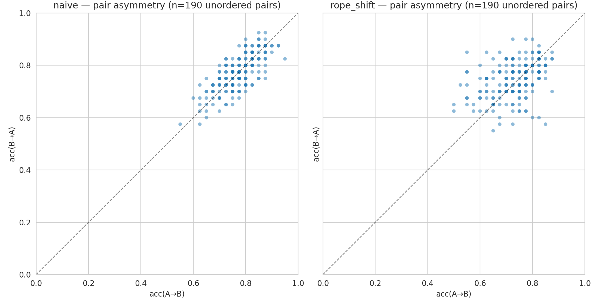
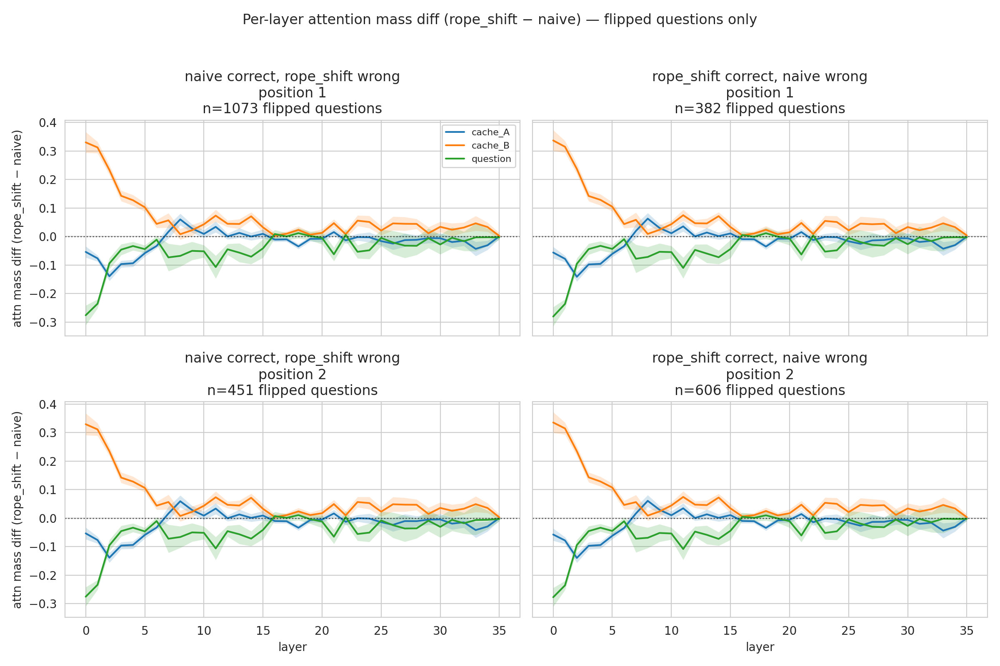

# Pair-stacked KV cache eval — Phase 2 findings (2026-04-07)

Phase 2 of the pair-stacked KV cache experiment scaled phase 1 (7 patients,
42 ordered pairs) up to all 20 LongHealth patients (380 ordered pairs ×
2 variants = **760 evaluations**). All 32 SLURM array tasks finished by
14:36 today, the canonical aggregator (jid 237753) ran 9 seconds later, and
a follow-up drill-down job (jid 242293) produced the four extra figures and
summary JSONs that this report is built on.

This report is the **findings** counterpart to the long-lived **data index**
at `contexts/06042026/PAIR_EXPERIMENT_REPORT.md`. The index tells you where
the data lives; this report tells you what we found.

For the per-pair `results.json` schema and the round-2 attention-mass
contract, see `contexts/06042026/ATTENTION_MASS_SPEC.md`. For the rope_shift
rationale, see `contexts/06042026/ROPE_SHIFT_NOTE.md`. For the session
journal that drove phase-1 closeout and phase-2 launch (and ate this
session's first hour), see
`contexts/07042026/PAIR_EXPERIMENT_PHASE1_CLOSEOUT_AND_PHASE2_LAUNCH.md`.

## TL;DR

- The phase-1 qualitative finding **holds at 9× the pair count**: naive
  concat shows essentially zero position bias (−0.50 pp recency at phase 2);
  uniformly RoPE-shifting cache_B's keys to non-aliased positions produces a
  strong recency bias (+10.63 pp at phase 2). The naive bias attenuated
  substantially from phase 1 (−3.33 → −0.50 pp); the rope_shift bias
  attenuated only slightly (+12.26 → +10.63 pp).
- Naive overall accuracy 77.21%, rope_shift 73.68% — a 3.53 pp gap. The
  rope_shift trade is **−9.09 pp on acc_pos1 / +1.04 pp on acc_pos2** (vs.
  naive), which is asymmetric: rope_shift hurts the first-position patient
  far more than it helps the second.
- **Pair asymmetry** (acc(A→B) vs. acc(B→A) for the same unordered pair) is
  **much larger under rope_shift than under naive**. Naive's biggest swap
  asymmetry is 12.5 pp; rope_shift's biggest is 30 pp.
- **Per-layer attention diff for flipped questions** (the centerpiece
  finding): the (rope_shift − naive) per-layer attention shift is
  **identical regardless of which variant got the question right**. The
  RoPE shift produces a deterministic early-layer attention redistribution
  (cache_B gains, cache_A loses, in roughly the first 8 layers) that is
  decoupled from whether the model ends up correct. Which questions flip
  in which direction is **not** explained by the early-layer attention shift
  alone.

## Phase 2 headline marginals

Computed by `scripts/aggregate_pair_results.py` over all 380 pairs per
variant, written to `long-health/pair_experiment/summary.json`.

| variant | overall | acc_pos1 | acc_pos2 | recency_bias (pos2 − pos1) |
|---|---|---|---|---|
| naive       | **77.21%** | 77.46% | 76.96% | **−0.50%** (essentially flat) |
| rope_shift  | **73.68%** | 68.37% | 79.00% | **+10.63%** (strong recency)  |

## Phase 1 → Phase 2 comparison

| variant | phase | n pairs | overall | acc_pos1 | acc_pos2 | recency_bias |
|---|---|---|---|---|---|---|
| naive       | 1 (7p)  | 42  | 75.83% | 77.50% | 74.17% | −3.33% |
| naive       | 2 (20p) | 380 | **77.21%** | **77.46%** | **76.96%** | **−0.50%** |
| rope_shift  | 1 (7p)  | 42  | 72.92% | 66.79% | 79.05% | +12.26% |
| rope_shift  | 2 (20p) | 380 | **73.68%** | **68.37%** | **79.00%** | **+10.63%** |

The rope_shift recency bias is robust to the larger sample (+12.26 → +10.63
pp; both ≫ 0). The naive position bias collapses to noise at the larger n
(−3.33 → −0.50 pp), suggesting the phase-1 primacy reading was a finite-sample
artifact and naive concat is approximately position-neutral. Overall accuracy
moves toward the larger-sample mean for both variants (naive +1.4 pp,
rope_shift +0.8 pp).

## Canonical per-layer attention-mass figure

The canonical aggregator's primary output: per-layer mean ± std attention
on cache_A / cache_B / question regions, split by variant × position ×
correctness. This is the same figure shape as phase 1 but with phase-2 sample
counts (n_pairs ≈ 380, n_questions ≈ 5000–6000 per cell).

## Drill-down 1: per-cell accuracy heatmaps

For each variant, a 20×20 heatmap of `overall_accuracy` indexed by
`(patient_A as first position, patient_B as second position)`. Diagonal is
NaN (no self-pairs). Colormap is divergent and centered at the variant's
own overall mean. The aggregator builds these matrices internally
(`scripts/aggregate_pair_results.py:_accuracy_matrices`) but never persists
or renders them — drill-down `scripts/preview_pair_analysis.py` does.

### Naive

The naive heatmap is **homogeneous**: most cells fall in 0.70–0.85, with
no rows or columns dramatically different from the rest. Patient_06 looks
slightly weaker on average but the effect is small.

### rope_shift

The rope_shift heatmap is **noticeably more variable** than naive at the
same color scale. Patient_06 stands out as a weak row/column; several
patient_06-containing pairs drop into the 0.55–0.65 range. Patient_05 and
patient_13 also show some weakness. The same patients are not flagged in
the naive heatmap, suggesting these are rope_shift-specific failure modes.

## Drill-down 2: pair asymmetry — acc(A→B) vs. acc(B→A)

For each unordered pair `{A, B}` (190 per variant), plot `(acc(A→B),
acc(B→A))` and reference line `y = x`. Off-diagonal points indicate
order-sensitive pairs.

**Observation**: naive points cluster tightly along `y = x` (in the
upper-right of the unit square); the maximum |acc(A→B) − acc(B→A)| is only
**12.5 pp**. rope_shift points are noticeably more dispersed and lower
on average; the maximum asymmetry is **30 pp**. The rope_shift recency
bias is not just a mean effect — it's heterogeneous across pairs, with
some pairs flipping by 20–30 pp depending on which patient is in the
first position.

### Top-10 most asymmetric pairs (naive)

| rank | A | B | acc(A→B) | acc(B→A) | \|Δ\| |
|---|---|---|---|---|---|
| 1 | patient_04 | patient_15 | 0.875 | 0.750 | 0.125 |
| 2 | patient_07 | patient_10 | 0.950 | 0.825 | 0.125 |
| 3 | patient_01 | patient_04 | 0.800 | 0.700 | 0.100 |
| 4 | patient_17 | patient_20 | 0.700 | 0.800 | 0.100 |
| 5 | patient_03 | patient_15 | 0.775 | 0.875 | 0.100 |
| 6 | patient_03 | patient_16 | 0.800 | 0.900 | 0.100 |
| 7 | patient_04 | patient_11 | 0.850 | 0.750 | 0.100 |
| 8 | patient_06 | patient_07 | 0.725 | 0.825 | 0.100 |
| 9 | patient_06 | patient_12 | 0.825 | 0.725 | 0.100 |
| 10 | patient_06 | patient_14 | 0.650 | 0.750 | 0.100 |

### Top-10 most asymmetric pairs (rope_shift)

| rank | A | B | acc(A→B) | acc(B→A) | \|Δ\| |
|---|---|---|---|---|---|
| 1 | patient_06 | patient_12 | 0.550 | 0.850 | **0.300** |
| 2 | patient_03 | patient_04 | 0.850 | 0.575 | 0.275 |
| 3 | patient_03 | patient_05 | 0.825 | 0.600 | 0.225 |
| 4 | patient_05 | patient_11 | 0.550 | 0.775 | 0.225 |
| 5 | patient_06 | patient_08 | 0.550 | 0.775 | 0.225 |
| 6 | patient_06 | patient_15 | 0.625 | 0.850 | 0.225 |
| 7 | patient_06 | patient_16 | 0.600 | 0.800 | 0.200 |
| 8 | patient_11 | patient_18 | 0.800 | 0.600 | 0.200 |
| 9 | patient_05 | patient_13 | 0.525 | 0.725 | 0.200 |
| 10 | patient_01 | patient_07 | 0.875 | 0.700 | 0.175 |

`patient_06` appears in **5 of the top-10** rope_shift entries (and appears
as the *low* side in 4 of those 5: putting patient_06 first hurts more than
putting it second). Patient_05 also appears multiple times. These are
candidate "rope_shift-fragile" patients worth investigating further — what
about their cache geometry or document content makes them especially
order-sensitive once their keys are remapped?

## Drill-down 3: per-question correctness flip contingency

Joining `naive` and `rope_shift` per-question records on
`(pair_a, pair_b, qid, position)` gives 380 × 40 = **15,200 paired
question records** (7,600 per position). Each can be classified as
`both_correct` / `both_wrong` / `naive_only` / `rope_only` (the last two
are the *flipped* questions where the variants disagree).

| position | both_correct | both_wrong | naive_only | rope_only | net flips |
|---|---|---|---|---|---|
| 1 | 4814 | 1331 | **1073** | 382 | naive +691 |
| 2 | 5398 | 1145 | 451 | **606** | rope +155 |

**Sanity check** (recovering the canonical marginals from the contingency):
- naive acc_pos1 = (4814 + 1073) / 7600 = 5887/7600 = **0.7746** ✓
- naive acc_pos2 = (5398 + 451) / 7600 = 5849/7600 = **0.7696** ✓
- rope_shift acc_pos1 = (4814 + 382) / 7600 = 5196/7600 = **0.6837** ✓
- rope_shift acc_pos2 = (5398 + 606) / 7600 = 6004/7600 = **0.7900** ✓
- naive overall = 11736/15200 = **0.7721** ✓
- rope_shift overall = 11200/15200 = **0.7368** ✓

These match `summary.json` exactly, confirming the join is correct.

**Net effect of the rope_shift on accuracy:**
- At position 1: naive wins **691 questions** net (1073 naive_only − 382 rope_only)
- At position 2: rope_shift wins **155 questions** net (606 rope_only − 451 naive_only)
- Total: naive gains 536 questions over rope_shift across the 15,200 paired
  records → 536 / 15200 = 3.53 pp accuracy advantage (matches 77.21 −
  73.68 = 3.53 pp ✓)

The full list of 2,512 flipped question records is dumped to
`long-health/pair_experiment/correctness_flips.json` for downstream
inspection.

## Drill-down 4: per-layer attention diff for flipped questions

This is the centerpiece finding. For each flipped question instance
(2,512 total: 1,455 at position 1, 1,057 at position 2), compute the
element-wise diff `rope_shift.attn_per_layer[region][layer] −
naive.attn_per_layer[region][layer]` for each layer (0..35) and each
region (cache_A, cache_B, question). Aggregate (mean ± std) across all
flipped questions in each `(flip_category, position)` cell.

The figure has 4 panels (2 rows = positions, 2 cols = flip categories);
each panel shows 3 lines for the per-layer diff for cache_A / cache_B /
question, with std bands and a `y = 0` reference. **Positive** = rope_shift
puts more attention on this region/layer than naive on the *same* question;
**negative** = naive does.

**The four panels look strikingly similar.** Whether naive is the variant
that got the question right (left column) or rope_shift is (right column),
the per-layer attention diff signature is essentially the same:

- **cache_B (orange)**: starts at **+0.30** at layer 0, decays to ≈0 by
  layer 7–10. Under rope_shift, the last question token at the early
  layers attends substantially more to cache_B than under naive.
- **cache_A (blue)**: starts at **−0.10 to −0.20** at layer 0, returns
  to ≈0 by layer 5. Naive puts more attention on cache_A in the early
  layers; rope_shift pulls attention away from cache_A.
- **question (green)**: oscillates wildly between −0.20 and +0.10 in
  layers 0–7, then settles. The early-layer behaviour is noisy but the
  net effect from layer ~10 onward is near zero.
- **After layer ~10**: all three lines hover near 0 with very tight std
  bands. The mid- and late-stack attention distributions are
  indistinguishable between naive and rope_shift on flipped questions.

**Std bands are tight relative to the means** — the early-layer pattern
is robust, not within-cell noise.

### Interpretation

The RoPE shift produces a **deterministic, uniform geometric perturbation**
of early-layer attention. Shifting cache_B's keys to non-aliased rotary
positions causes the last question token (which lives at fresh positions
itself) to attend more to cache_B and less to cache_A in the first few
attention layers — this is mechanical: the relative-position dot products
in those layers respond to the alignment. The fact that the diff signature
is **essentially identical for `naive_only` and `rope_only` flips** says
that this attention shift is **decoupled from the correctness flip**: the
same shift hits questions whether the model ends up correct under naive,
correct under rope_shift, both, or neither.

In other words: the early-layer attention shift alone does **not** predict
which questions will flip in which direction. Whatever the rope_shift
*actually* does to performance is downstream of the early-layer attention
shift — it must enter via some pathway that the per-layer attention mass
on the {A, B, Q} regions doesn't surface. (Candidate hypotheses for
follow-up: per-head behaviour rather than per-layer averages; effects on
specific value vectors rather than attention weights; impact on the
question token's residual stream after the early layers re-distribute
attention.)

**Worth noting**: this null result is itself informative. If the
hypothesis "rope_shift reorganizes early-layer attention onto cache_B,
which causes the recency bias" were correct, we'd expect the diff
signature in `naive_only` flips (where rope_shift caused a *failure*)
to look different from `rope_only` flips (where rope_shift caused a
*success*). They don't. So the per-layer per-region attention diff is
**not** the right level of granularity to explain the recency bias.

## Where the data and outputs live

| Path | Contents |
|---|---|
| `long-health/pair_experiment/{naive,rope_shift}/pair_<A>_<B>/results.json` | Per-pair eval results, round-2 schema. 380 per variant. |
| `long-health/pair_experiment/summary.json` | Canonical phase-2 marginals (overwritten by jid 237753 at 14:36). |
| `long-health/pair_experiment/summary_extended.json` | Drill-down extras: pair_asymmetry top-10, contingency, n_flipped per cell. |
| `long-health/pair_experiment/correctness_flips.json` | All 2,512 flipped question records (pair, qid, position, flip direction). |
| `long-health/pair_experiment/figures/attn_mass_after_per_layer.{png,pdf}` | Canonical attention figure (overwritten by jid 237753). |
| `long-health/pair_experiment/figures/accuracy_heatmap_{naive,rope_shift}.{png,pdf}` | Drill-down 1 outputs. |
| `long-health/pair_experiment/figures/pair_asymmetry.{png,pdf}` | Drill-down 2 output. |
| `long-health/pair_experiment/figures/attn_diff_flipped.{png,pdf}` | Drill-down 4 output (the centerpiece). |
| `scripts/preview_pair_analysis.py` | Generates the four drill-down outputs from the per-pair JSON files. |
| `scripts/marlowe/preview_pair_analysis.sh` | SLURM wrapper for the above. CPU-only (-p batch, 2 cpus, 16G mem, 30 min wall). |

## SLURM jobs of record

| jid | role | state | wall |
|---|---|---|---|
| 236625 | naive array (16 tasks) | COMPLETED | first task 2026-04-06 23:02 → last task 2026-04-07 04:32 |
| 236687 | rope_shift first half (8 tasks) | COMPLETED | 2026-04-07 04:32 → 09:43 |
| 237733 | rope_shift second half (8 tasks) | COMPLETED | 2026-04-07 08:39 → 14:36 |
| 237753 | canonical aggregator | COMPLETED | 2026-04-07 14:36:25 → 14:36:34 (9 s) |
| 242293 | drill-down job (this report) | COMPLETED | 2026-04-07 16:07:11 → 16:07:18 (7 s) |

## Open follow-ups

- **Per-head attention analysis on flipped questions.** The per-layer
  per-region averages don't separate the flip directions — but a per-head
  view might. The raw `per_question.attn_per_layer` we have is already
  averaged over heads at telemetry time, so this would require re-running
  eval with a per-head attention-mass collection variant.
- **Patient_06-specific deep dive.** Patient_06 dominates the rope_shift
  asymmetry top-10 and is one of the visibly weaker patients in the
  rope_shift heatmap. Worth pulling its document characteristics and
  question types to see what makes it rope_shift-fragile.
- **k=5 stacking probe.** Tracked separately in `contexts/07042026/K5_PROBE_PLAN.md`
  — the next step in the stacking investigation now that pair (k=2) is
  characterized at scale.
