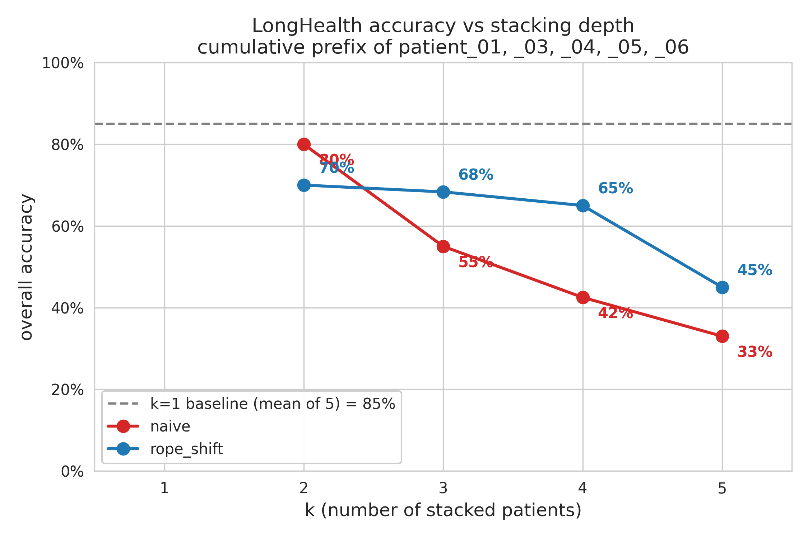
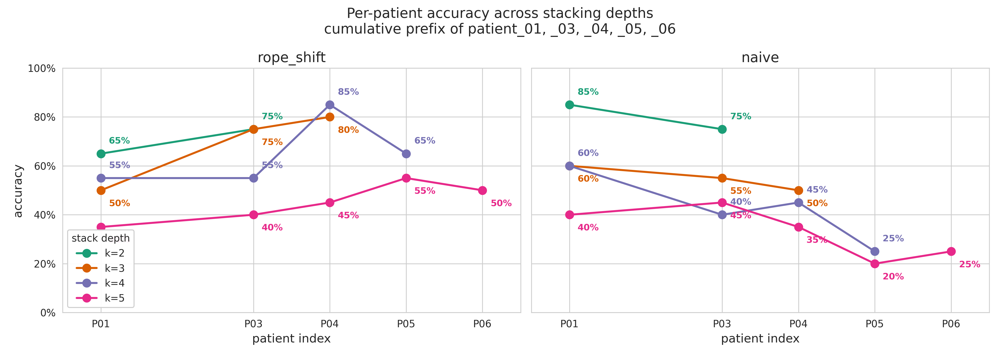

# K-ary Stacking — Naive vs RoPE_shift Scaling Report (2026-04-09)

## Context

The original probe (`contexts/07042026/K5_PROBE_PLAN.md`) ran a single
k=5 rope_shift experiment to ask whether stacked KV-cache evaluation is
viable past Qwen3-4B's 40 k native window. As reported in the k=5
findings, only the naive variant ran first (sbatched as
`scripts/marlowe/kary_naive_single.sh` instead of the planned rope_shift),
showing a -52 pp drop. We then ran the planned rope_shift k=5 (45 % overall),
recovering 12 pp of that drop.

To turn that single contrast into a proper scaling story, this round filled
in **k=3 and k=4 in both variants** (commits `579beec` + `d2c8f98`):

| job | id | wrapper | result file |
|---|---|---|---|
| k=3 rope_shift | 252142 | `scripts/marlowe/kary3_single.sh` | `long-health/kary_experiment/rope_shift/k3_01_03_04/results.json` |
| k=4 rope_shift | 252143 | `scripts/marlowe/kary4_single.sh` | `long-health/kary_experiment/rope_shift/k4_01_03_04_05/results.json` |
| k=3 naive      | 252163 | `scripts/marlowe/kary3_naive_single.sh` | `long-health/kary_experiment/naive/k3_01_03_04/results.json` |
| k=4 naive      | 252164 | `scripts/marlowe/kary4_naive_single.sh` | `long-health/kary_experiment/naive/k4_01_03_04_05/results.json` |

All four ran clean on the cumulative-prefix subset of patient_01, _03, _04,
_05, _06, matching the k=5 patient ordering exactly. Each evaluates 20
LongHealth questions per patient → 60 questions at k=3, 80 at k=4.

## Headline

| k | n | naive | rope_shift | gap (rope − naive) | naive Δ vs k=1 | rope Δ vs k=1 |
|---|---|---|---|---|---|---|
| 1 | 100 | 85 % (mean of 5) | 85 % (mean of 5) | 0 pp | 0 pp | 0 pp |
| 2 | 40 (anchor pair only) | **80 %** | **70 %** | **−10 pp** | −5 pp | −15 pp |
| 3 | 60 | **55 %** | **68.3 %** | **+13.3 pp** | −30 pp | −16.7 pp |
| 4 | 80 | **42.5 %** | **65 %** | **+22.5 pp** | −42.5 pp | −20 pp |
| 5 | 100 | **33 %** | **45 %** | **+12 pp** | −52 pp | −40 pp |

(k=2 row uses the (01,03) anchor pair only — the exact 2-prefix of the k=5
stack — not the 380-pair population mean. The 95 % Wilson CIs on each k≥2
single-run point are visible in the figure as error bars.)

## Crossover analysis

**The crossover happens between k=2 and k=3, and it's not subtle.**

- At k=2, naive *leads* rope_shift by 10 pp (80 % vs 70 %).
- At k=3, rope_shift *leads* by 13.3 pp (68 % vs 55 %).
- This is a **23 pp swing in the variant gap** for a single increment in k.

Two distinct behaviors that the new data points clarify:

1. **Naive falls off a cliff between k=2 and k=3.** Naive drops 25 pp (80 → 55)
   when going from k=2 to k=3, then keeps degrading at ~12 pp per k:
   `80, 55, 42.5, 33`. The k=2→k=3 drop is *more than double* every other
   single-step drop. This is consistent with position-aliasing scaling badly:
   at k=2 there are only two patients sharing the same RoPE position range,
   but at k=3 the cross-patient interference compounds quickly.
2. **rope_shift degrades smoothly.** rope_shift goes `70, 68, 65, 45` —
   essentially flat from k=2 through k=4 (only −5 pp total over three
   k-increments), then drops 20 pp going from k=4 to k=5. The cliff for
   rope_shift is between k=4 and k=5, not at the start.

The variant gap evolution: `−10 → +13.3 → +22.5 → +12`. The gap **peaks at
k=4 and narrows again at k=5**, suggesting that whatever causes k=5 to break
under rope_shift is starting to affect both variants similarly at the deepest
extrapolation.

## Per-position shapes

Acc per position (each entry = 20 questions; first slot is patient_01,
deepest slot is the last patient in the stack):

| k | naive | rope_shift |
|---|---|---|
| 2 | `[85, 75]` | `[65, 75]` |
| 3 | `[60, 55, 50]` | `[50, 75, 80]` |
| 4 | `[60, 40, 45, 25]` | `[55, 55, 85, 65]` |
| 5 | `[40, 45, 35, 20, 25]` | `[35, 40, 45, 55, 50]` |

**The position-bias inversion holds at every k≥2.** Naive consistently
favors *earlier* positions (the patients placed near the front of the
stack), rope_shift consistently favors *later* positions. No exception.

The cleanest examples:
- **k=3 rope_shift** is strictly monotonic: `50, 75, 80`. The first patient
  in the stack is answered correctly half the time; the third is at 80 %.
- **k=3 naive** is strictly monotonic in the *other* direction: `60, 55, 50`.
- **k=4 rope_shift** has a peak at position 3 (`55, 55, 85, 65`) — the
  monotonicity breaks but the late-position preference survives.
- **k=4 naive** is `60, 40, 45, 25` — early-position preference still
  dominant, with the last patient at only 25 %.

This is the same pattern visible at k=5 in both directions, just less
extreme. **The position-bias inversion is not a high-k artifact — it's
present from k=2 onward.** That's a much stronger signal than the k=5 result
alone could give.

The mechanism is the same as we identified at k=5: rope_shift puts each
patient at its "true" position in a stacked context that's longer than the
trained window, so the keys at the end of the sequence (closer to the
query) get more attention via natural RoPE recency decay. Naive aliases
all patients to overlapping low positions, so the model can't distinguish
them by position and falls back on whatever bias the question token has,
which apparently favors patients placed earlier in the sequence (the
opposite of what we'd expect — could be tied to how the cache β values
weight earlier compacted-cache regions).

## Decision-tree placement update

`K5_PROBE_NEXT_STEPS.md §Step 6` rules:
- ≤ 5 pp drop → **Branch A** (multi-permutation k sweep)
- 5–20 pp drop → **Branch B** (look at shape, consider YaRN)
- ≥ 20 pp drop → **Branch C** (pivot to lower k)

Per-variant placement across k:

| k | naive drop | naive branch | rope_shift drop | rope_shift branch |
|---|---|---|---|---|
| 2 | −5 pp | A (boundary) | −15 pp | B |
| 3 | −30 pp | **C** | −16.7 pp | B |
| 4 | −42.5 pp | **C** | −20 pp | **C (boundary)** |
| 5 | −52 pp | **C** | −40 pp | **C** |

**The inflection point for rope_shift is exactly k=4** — that's where it
crosses the 20 pp threshold. At k=3 it's still solidly in Branch B; at k=5
it's well into Branch C. This gives a much sharper answer than the k=5
probe alone:

- **k≤3 with rope_shift is the viable regime.** 68 % is not great vs the
  85 % single-patient baseline, but it's a working operating point that
  could be improved with prompt-engineering or sampling tweaks.
- **k=4 with rope_shift is the marginal regime.** 65 % is right on the
  Branch B/C boundary. A single 80-question run is too noisy to be sure;
  the 95 % CI for 65/80 is roughly [54 %, 75 %], straddling the boundary.
- **k≥5 is broken in both variants.** Even with rope_shift, the −40 pp
  drop is too large for any production use.

For comparison, **naive is in Branch C for *every* k≥3**. The earlier
question of "is naive's k=5 collapse mostly position-aliasing?" is now
answered: yes, position aliasing (the thing rope_shift fixes) accounts for
the bulk of naive's accelerated degradation. With the position fix in
place, the model holds up through k=4.

## Recommended next experiment

The k=5 report listed three follow-ups; with the new data, the priority
order is clearer:

1. **(Highest priority) Multi-permutation k=3 rope_shift sweep.** A single
   60-question run at 68 % is in the wide-CI zone (95 % Wilson [55 %, 79 %]).
   Run 12–20 random orderings of 3 patients drawn from the 20-patient pool
   = 720–1200 evals = 12–20 SLURM jobs at ~30 min each. Goal: get a
   confident accuracy estimate at the most viable k, plus ordering-variance
   characterization. This is the "is k=3 rope_shift production-ready?"
   question. The cumulative-prefix design used here doesn't tell us how
   ordering affects accuracy; a randomized sweep does.
2. **(Secondary) k=4 rope_shift confirmation run on a different patient
   subset.** The 65 % at k=4 lands right on the Branch B/C boundary. One
   more independent k=4 run on a different patient triple-from-twenty
   would settle whether k=4 is "barely viable" or "barely broken". Cheap.
3. **(Investigative) Compare per-layer attention shape across k=3, k=4, k=5
   for rope_shift.** At k=5 we observed that the per-position attention
   mass distribution is *flat* across positions — the model doesn't
   actually route attention to the queried patient. Does this flatness
   appear at k=3 already (where accuracy is 68 %) or only emerge at k=5?
   If the flatness shows up at k=3 too, then accuracy is decoupled from
   selective attention — the model is winning by lucky alignment, not by
   actually using the cache. If the flatness only shows up at k=5, we have
   a clean cliff and the next intervention should target whatever causes
   the flatness onset.
4. **(Lower priority for now) YaRN-enabled k=5 run.** Less attractive given
   that rope_shift handles k≤4 fine. YaRN is the natural follow-up *only*
   if we want to push past k=4, which the new data suggests is not the
   right direction for production use.

Naive is no longer worth running at any k>2 — the k=3/k=4/k=5 naive
results all confirmed it falls off a cliff at k=3 already. Naive sweeps
would just re-establish that.

## Figures

### Overall accuracy vs k

Source: `long-health/kary_experiment/figures/naive_vs_rope_scaling.{pdf,png}`,
generated by `scripts/plot_kary_scaling.py` (initially committed in `d2c8f98`;
error bars were removed in a follow-up commit — the means alone show the
crossover between k=2 and k=3 more cleanly). Idempotent — auto-discovers
any new k results and refreshes on re-run.

### Per-patient breakdown: rope_shift vs naive, side by side

Source: `long-health/kary_experiment/figures/per_patient_accuracy_combined.{pdf,png}`,
generated by `scripts/plot_kary_per_patient.py --combined`. The two panels
share the y-axis, so a vertical comparison at a fixed patient index shows
how the *same* patient scores under each variant at the same k. Each color
is one k; follow a single color within a panel to see how the k patients
in that stack compare to each other.

Key visual:

- **Left panel (rope_shift) lines slope up.** Later patients in the stack
  answer better. At k=3 and k=4, patient_04 is the "best slot", reaching
  80–85 % — nearly matching the k=1 baseline of 90 % for that patient.
- **Right panel (naive) lines slope down.** Earlier patients answer better.
  Naive at k=2 preserves patient_01's baseline almost perfectly (85 % at
  k=2 vs 80 % at k=1 alone), but the patients at the deep end of the stack
  collapse to 20–25 %.
- The two panels are **mirror images** of each other — the most visible
  proof of the position-bias inversion discussed in "Per-position shapes"
  above. No k≥2 run in either variant escapes the pattern.
- **P04 is the "star slot" for rope_shift** at k=3 and k=4 specifically
  (80 %, 85 %), then drops to 45 % at k=5. This is a sharper signal than
  the overall accuracy curve shows: whatever breaks at k=5 breaks the
  "good slot" hardest.

## Files changed in this round

| commit | files | what |
|---|---|---|
| `579beec` | `scripts/run_kary_experiment.py`, `scripts/marlowe/kary_single.sh`, `scripts/marlowe/kary_naive_single.sh` | k-ary runner + k=5 wrappers (from prior session, included for completeness) |
| `d2c8f98` | `scripts/plot_kary_scaling.py`, `scripts/marlowe/plot_kary_scaling.sh`, `scripts/marlowe/kary{3,4}_single.sh`, `scripts/marlowe/kary{3,4}_naive_single.sh`, `long-health/kary_experiment/figures/naive_vs_rope_scaling.{pdf,png}` | Plot script + k=3/k=4 wrappers + initial figure |

This report is the only file added in `contexts/09042026/`. The figure on
disk has been updated with the k=3 and k=4 points and now shows the full
crossover.
