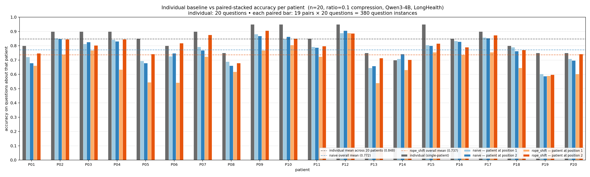
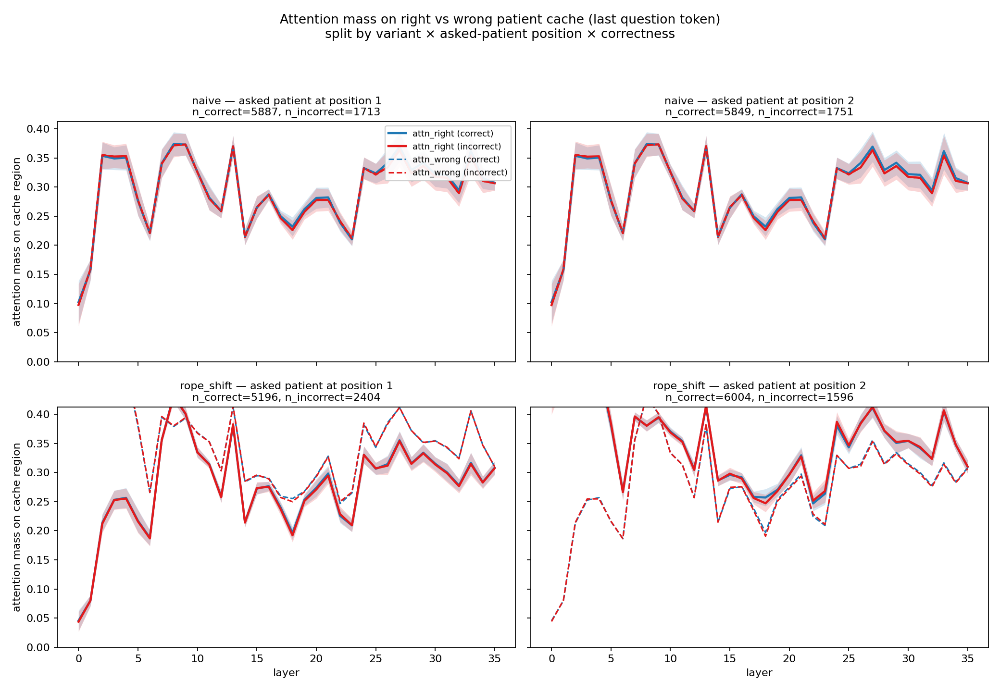

# Pair-stacked KV cache eval — comprehensive results report (2026-04-09)

This is the canonical, standalone results document for the pair-stacked KV
cache experiment as it stands on 2026-04-09. It catalogs everything in
`long-health/pair_experiment/`, explains every figure, and adds two new
drill-downs that were not in the prior reports:

- **Drill-down 5** — individual baseline vs paired-stacked accuracy per
  patient (the *cost of pairing* on top of the compression budget).
- **Drill-down 6** — does the model attend to the *right* patient given the
  question? And does that selectivity break down on incorrect answers?

The session journal that closed phase 1 and launched phase 2 lives at
`contexts/07042026/PAIR_EXPERIMENT_PHASE1_CLOSEOUT_AND_PHASE2_LAUNCH.md`.
The phase-2 findings (drill-downs 1–4 only) live at
`contexts/07042026/PAIR_EXPERIMENT_PHASE2_REPORT.md`. The long-lived data
index lives at `contexts/06042026/PAIR_EXPERIMENT_REPORT.md`. This document
supersedes the prior reports as the canonical reference but does not replace
them — they remain useful as session journal + chronological narrative.

## TL;DR

- **Headline accuracies (380 pairs × 2 variants)**: naive concat 77.21%
  overall, rope_shift 73.68%. The position bias is essentially flat under
  naive (−0.50 pp recency) and strongly recency-biased under rope_shift
  (+10.63 pp).
- **Cost of stacking on top of the 0.1× compression budget**: under naive
  concat, pairing costs **−7.5 pp** vs the individual single-patient baseline
  on the same compacted cache (84.75% individual → 77.21% paired). Under
  rope_shift, pairing costs **−11.1 pp** (84.75% → 73.68%). Individual
  baselines and per-patient marginals are computed on the same 20 questions
  per patient and the same Qwen3-4B model — only the surrounding context
  differs.
- **Attention selectivity is essentially zero under naive concat** and
  **strongly position-asymmetric but correctness-independent under
  rope_shift**. Under naive, the model attends ~equally to both cache regions
  regardless of which patient is being asked about (selectivity ≈ 0.000). Under
  rope_shift, the model biases ~8 pp of attention mass toward cache_B
  regardless of which patient is asked — and the bias is the same for
  questions answered correctly and incorrectly. This echoes the null result
  from the existing drill-down 4: **per-region per-layer attention mass is
  not the level of granularity that distinguishes correct from incorrect
  questions**, in either variant.
- **patient_05, patient_15, patient_19 are the most-degraded patients** under
  both variants (Δ ≤ −15 pp from individual baseline). **patient_06 is
  NOT** in the top individual losers — but it IS the dominant name in the
  pair-asymmetry top-10 and the rope_shift heatmap. So patient_06's
  pair-fragility comes from hurting *the other* patient in the pair rather
  than itself. **patient_14 is the only patient that gains from naive
  stacking** (+2.5 pp); no patient gains under rope_shift.

## 1. Headline marginals (Phase 2)

Computed by `scripts/aggregate_pair_results.py` from all 380 per-pair
results × 2 variants and written to
`long-health/pair_experiment/summary.json`.

| variant | overall | acc_pos1 | acc_pos2 | recency_bias (pos2 − pos1) |
|---|---|---|---|---|
| naive       | **77.21%** | 77.46% | 76.96% | **−0.50%** (essentially flat) |
| rope_shift  | **73.68%** | 68.37% | 79.00% | **+10.63%** (strong recency)  |

`acc_pos1` and `acc_pos2` are the marginal accuracies on questions about the
patient at position 1 and position 2 respectively, averaged over all 7,600
questions per cell (380 pairs × 20 questions per position). The
recency-bias is the difference and matches summary.json's
`recency_bias_estimate`.

The naive position bias collapses to essentially noise; uniformly
RoPE-shifting cache_B's keys to non-aliased positions costs ~9 pp on
acc_pos1 and *gains* ~1 pp on acc_pos2 vs naive — an asymmetric trade that
costs ~3.5 pp overall and produces a strong recency bias as a side effect.

## 2. Phase 1 → Phase 2 comparison

| variant | phase | n pairs | overall | acc_pos1 | acc_pos2 | recency_bias |
|---|---|---|---|---|---|---|
| naive       | 1 (7p)  |  42 | 75.83% | 77.50% | 74.17% | −3.33% |
| naive       | 2 (20p) | 380 | **77.21%** | **77.46%** | **76.96%** | **−0.50%** |
| rope_shift  | 1 (7p)  |  42 | 72.92% | 66.79% | 79.05% | +12.26% |
| rope_shift  | 2 (20p) | 380 | **73.68%** | **68.37%** | **79.00%** | **+10.63%** |

The rope_shift recency bias is robust to the larger sample (+12.26 → +10.63
pp; both ≫ 0). The naive position bias collapses to noise at the larger n
(−3.33 → −0.50 pp), suggesting the phase-1 primacy reading was a
finite-sample artifact and naive concat is approximately position-neutral.

## 3. Folder inventory

```
long-health/pair_experiment/
├── naive/                                 380 per-pair subdirs
│   └── pair_patient_<A>_patient_<B>/
│       └── results.json                   round-2 schema (see §4)
├── rope_shift/                            380 per-pair subdirs (same shape)
│   └── pair_patient_<A>_patient_<B>/
│       └── results.json
├── figures/                               14 files (7 figures × 2 formats)
│   ├── attn_mass_after_per_layer.{png,pdf}      canonical aggregator output
│   ├── accuracy_heatmap_naive.{png,pdf}         drill-down 1
│   ├── accuracy_heatmap_rope_shift.{png,pdf}    drill-down 1
│   ├── pair_asymmetry.{png,pdf}                 drill-down 2
│   ├── attn_diff_flipped.{png,pdf}              drill-down 4
│   ├── individual_vs_paired.{png,pdf}           drill-down 5 (NEW)
│   └── attn_on_right_patient.{png,pdf}          drill-down 6 (NEW)
├── summary.json                           3.1K  canonical marginals
├── summary_extended.json                  3.6K  pair_asymmetry top-10 + contingency
├── correctness_flips.json                 346K  2,512 flipped per-question records
├── individual_vs_paired_summary.json      15K   per-patient comparison (NEW)
└── attention_selectivity_summary.json     63K   per-cell selectivity stats (NEW)
```

`naive/` and `rope_shift/` each contain exactly 380 per-pair subdirs (all 20
LongHealth patients × 19 partners, both orderings). Per-pair subdirs are
named `pair_patient_<A>_patient_<B>` (verbose form). Diagonal pairs (a
patient with itself) are excluded by construction.

## 4. Per-pair `results.json` schema

Verified by direct read of
`naive/pair_patient_01_patient_02/results.json`:

```
{
  "variant": "naive",
  "pair": ["patient_01", "patient_02"],
  "model": "Qwen/Qwen3-4B",
  "seq_len_A": ...,           // length of cache_A
  "seq_len_B": ...,           // length of cache_B
  "stacked_original_seq_len": ...,
  "max_layer_len": ...,
  "t_A_per_layer": [..36 ints..],   // per-layer cache_A token counts
  "t_B_per_layer": [..36 ints..],
  "attn_mass_before": {              // per-layer attention before answer generation
    "per_layer": [[mean_A, mean_B], ...],
    "mean_A": float,
    "mean_B": float
  },
  "attn_mass_after_aggregate": {     // per-layer attention after answer, by position × correctness
    "position_1": {
      "correct":   {"per_layer": [{A_mean, B_mean, Q_mean, A_std, ...}, ...], "n": int},
      "incorrect": {...}
    },
    "position_2": {...}
  },
  "overall_accuracy": float,         // (correct_pos1 + correct_pos2) / 40
  "acc_pos1": float,                 // correct_pos1 / 20
  "acc_pos2": float,                 // correct_pos2 / 20
  "correct": int,
  "total": 40,
  "per_question": [                  // 40 records, 20 per position
    {
      "qid": "patient_01_q0",
      "patient": "patient_01",       // asked-about patient
      "position": 1,                 // 1 or 2
      "correct": true,
      "pred": 4,
      "gold": 4,
      "attn_per_layer": {            // per-layer attention shares from last Q token
        "A": [..36 floats..],        // share on cache_A region
        "B": [..36 floats..],        // share on cache_B region
        "Q": [..36 floats..]         // share on the question region itself
      }
    },
    ...
  ]
}
```

At each layer, `A + B + Q ≈ 1.0` (per-region shares sum to 1). The full
contract for the round-2 schema lives at
`contexts/06042026/ATTENTION_MASS_SPEC.md`.

## 5. Figure 1: Canonical per-layer attention mass


The canonical aggregator's primary output. 4 row-cell × 4 column-cell layout:
**rows** = question position (1, 2); **columns** = (variant, correctness) =
(naive, correct), (naive, incorrect), (rope_shift, correct), (rope_shift,
incorrect). Each subplot shows 3 lines (cache_A blue, cache_B orange,
question green) of per-layer mean ± std attention mass on the last question
token. Sample counts (`n=...`) in each subplot title come from the per-pair
`attn_mass_after_aggregate` buckets — typically several thousand questions
across hundreds of pairs per cell. The std bands are pooled per-pair-conditional
stds (averaged across pairs); they're an exploratory band, not a confidence
interval. Generated by `scripts/aggregate_pair_results.py:_plot_attention_mass`.

## 6. Drill-down 1: per-cell accuracy heatmaps

For each variant, a 20×20 heatmap of `overall_accuracy` indexed by
`(patient_A as first position, patient_B as second position)`. Diagonal is
NaN (no self-pairs). Colormap is divergent (RdYlGn) and centered on the
variant's own overall mean. Generated by
`scripts/preview_pair_analysis.py:plot_accuracy_heatmap`.

### Naive


The naive heatmap is **homogeneous**: most cells fall in 0.70–0.85, with no
rows or columns dramatically different from the rest. Patient_06 looks
slightly weaker on average but the effect is small.

### Rope_shift


The rope_shift heatmap is **noticeably more variable** than naive at the
same color scale. Patient_06 stands out as a weak row/column; several
patient_06-containing pairs drop into the 0.55–0.65 range. patient_05 and
patient_13 also show some weakness. The same patients are not flagged in
the naive heatmap, suggesting these are rope_shift-specific failure modes.

**Important note**: the heatmap cells are pair-overall accuracies — i.e.,
the average of the two patients' question performance in each pair. So a
weak row for patient_06 means "pairs containing patient_06 score lower
overall", which can mean either (a) patient_06 itself answers worse in pairs,
or (b) patient_06's presence hurts the *other* patient in the pair. We
disambiguate this in drill-down 5 by comparing per-asked-patient marginals
to individual baselines — and patient_06 turns out to be NOT in the top-5
individual losers, so it's mostly (b).

## 7. Drill-down 2: pair asymmetry — acc(A→B) vs acc(B→A)


For each unordered pair `{A, B}` (190 per variant), plot
`(acc(A→B), acc(B→A))` and reference line `y = x`. Off-diagonal points
indicate order-sensitive pairs.

**Observation**: naive points cluster tightly along `y = x` (in the
upper-right of the unit square); the maximum |acc(A→B) − acc(B→A)| is only
**12.5 pp**. rope_shift points are noticeably more dispersed and lower on
average; the maximum asymmetry is **30 pp**. The rope_shift recency bias is
not just a mean effect — it's heterogeneous across pairs, with some pairs
flipping by 20–30 pp depending on which patient is in the first position.

### Top-10 most asymmetric pairs (naive)

| rank | A | B | acc(A→B) | acc(B→A) | \|Δ\| |
|---|---|---|---|---|---|
| 1 | patient_04 | patient_15 | 0.875 | 0.750 | 0.125 |
| 2 | patient_07 | patient_10 | 0.950 | 0.825 | 0.125 |
| 3 | patient_01 | patient_04 | 0.800 | 0.700 | 0.100 |
| 4 | patient_17 | patient_20 | 0.700 | 0.800 | 0.100 |
| 5 | patient_03 | patient_15 | 0.775 | 0.875 | 0.100 |
| 6 | patient_03 | patient_16 | 0.800 | 0.900 | 0.100 |
| 7 | patient_04 | patient_11 | 0.850 | 0.750 | 0.100 |
| 8 | patient_06 | patient_07 | 0.725 | 0.825 | 0.100 |
| 9 | patient_06 | patient_12 | 0.825 | 0.725 | 0.100 |
| 10 | patient_06 | patient_14 | 0.650 | 0.750 | 0.100 |

### Top-10 most asymmetric pairs (rope_shift)

| rank | A | B | acc(A→B) | acc(B→A) | \|Δ\| |
|---|---|---|---|---|---|
| 1 | patient_06 | patient_12 | 0.550 | 0.850 | **0.300** |
| 2 | patient_03 | patient_04 | 0.850 | 0.575 | 0.275 |
| 3 | patient_03 | patient_05 | 0.825 | 0.600 | 0.225 |
| 4 | patient_05 | patient_11 | 0.550 | 0.775 | 0.225 |
| 5 | patient_06 | patient_08 | 0.550 | 0.775 | 0.225 |
| 6 | patient_06 | patient_15 | 0.625 | 0.850 | 0.225 |
| 7 | patient_06 | patient_16 | 0.600 | 0.800 | 0.200 |
| 8 | patient_11 | patient_18 | 0.800 | 0.600 | 0.200 |
| 9 | patient_05 | patient_13 | 0.525 | 0.725 | 0.200 |
| 10 | patient_01 | patient_07 | 0.875 | 0.700 | 0.175 |

`patient_06` appears in **5 of the top-10** rope_shift entries (and as the
*low* side in 4 of those 5: putting patient_06 first hurts more than
putting it second). patient_05 also appears multiple times.

## 8. Drill-down 3: per-question correctness flip contingency

Joining `naive` and `rope_shift` per-question records on
`(pair_a, pair_b, qid, position)` gives 380 × 40 = **15,200 paired question
records** (7,600 per position). Each can be classified as
`both_correct` / `both_wrong` / `naive_only` / `rope_only` (the last two
are the *flipped* questions where the variants disagree).

| position | both_correct | both_wrong | naive_only | rope_only | net flips |
|---|---|---|---|---|---|
| 1 | 4814 | 1331 | **1073** | 382 | naive +691 |
| 2 | 5398 | 1145 | 451 | **606** | rope +155 |

**Sanity check** — recovers the canonical marginals from the contingency:

- naive acc_pos1 = (4814 + 1073) / 7600 = 5887/7600 = **0.7746** ✓
- naive acc_pos2 = (5398 + 451) / 7600 = 5849/7600 = **0.7696** ✓
- rope_shift acc_pos1 = (4814 + 382) / 7600 = 5196/7600 = **0.6837** ✓
- rope_shift acc_pos2 = (5398 + 606) / 7600 = 6004/7600 = **0.7900** ✓
- naive overall = 11736/15200 = **0.7721** ✓
- rope_shift overall = 11200/15200 = **0.7368** ✓

**Net effect of the rope_shift on accuracy:**

- At position 1: naive wins **691 questions** net (1073 naive_only − 382 rope_only)
- At position 2: rope_shift wins **155 questions** net (606 rope_only − 451 naive_only)
- Total: naive gains 536 questions over rope_shift across the 15,200 paired
  records → 536 / 15200 = 3.53 pp accuracy advantage (matches 77.21 −
  73.68 = 3.53 pp ✓)

The full list of 2,512 flipped question records is dumped to
`long-health/pair_experiment/correctness_flips.json` for downstream
inspection. No standalone figure for this drill-down — the contingency
table itself is the output.

## 9. Drill-down 4: per-layer attention diff for flipped questions


For each flipped question instance (2,512 total: 1,455 at position 1, 1,057
at position 2), compute the element-wise diff
`rope_shift.attn_per_layer[region][layer] − naive.attn_per_layer[region][layer]`
for each layer (0..35) and each region (cache_A, cache_B, question).
Aggregate (mean ± std) across all flipped questions in each
`(flip_category, position)` cell. The figure has 4 panels (2 rows = positions,
2 cols = flip categories); each panel shows 3 lines for the per-layer diff
for cache_A / cache_B / question, with std bands and a `y = 0` reference.
**Positive** = rope_shift puts more attention on this region/layer than
naive on the *same* question; **negative** = naive does.

**The four panels look strikingly similar.** Whether naive is the variant
that got the question right (left column) or rope_shift is (right column),
the per-layer attention diff signature is essentially the same:

- **cache_B (orange)**: starts at **+0.30** at layer 0, decays to ≈0 by
  layer 7–10. Under rope_shift, the last question token at the early
  layers attends substantially more to cache_B than under naive.
- **cache_A (blue)**: starts at **−0.10 to −0.20** at layer 0, returns
  to ≈0 by layer 5. Naive puts more attention on cache_A in the early
  layers; rope_shift pulls attention away from cache_A.
- **question (green)**: oscillates wildly between −0.20 and +0.10 in
  layers 0–7, then settles. The early-layer behaviour is noisy but the
  net effect from layer ~10 onward is near zero.
- **After layer ~10**: all three lines hover near 0 with very tight std
  bands. The mid- and late-stack attention distributions are
  indistinguishable between naive and rope_shift on flipped questions.

**Interpretation**: the RoPE shift produces a deterministic, uniform
geometric perturbation of early-layer attention. The fact that the diff
signature is essentially identical for `naive_only` and `rope_only` flips
says that this attention shift is **decoupled from the correctness flip**.
The early-layer attention shift alone does **not** predict which questions
will flip in which direction. Drill-down 6 below tests a related
hypothesis at finer granularity (right vs wrong patient cache rather than
rope vs naive) and finds the same null pattern.

## 10. Drill-down 5 (NEW): individual baseline vs paired-stacked accuracy



**Method**. For each of the 20 LongHealth patients X, we compare 5 accuracy
numbers, all on the SAME 20 questions about X with the SAME compacted KV
cache (ratio=0.1) and the SAME Qwen3-4B model:

1. **`individual`** — single-patient eval from `long-health/patient_<XX>/results.json`.
   1 eval, 20 questions about X, X's compacted cache alone.
2. **`naive_pos1`** — when X is at position 1 in a naive-concat stacked pair,
   averaged over the 19 pairs (X, Y) for Y != X. **n = 19 × 20 = 380** question
   instances about X.
3. **`naive_pos2`** — when X is at position 2, averaged over the 19 (Y, X) pairs.
   n = 380.
4. **`rope_pos1`** — same as (2) but with the rope_shift remapping of cache_B's keys.
5. **`rope_pos2`** — same as (3) but rope_shift.

The per-patient marginals (2)–(5) are computed by walking the `per_question`
records of all 760 per-pair `results.json` files and counting `correct/total`
per `(asked_patient, position, variant)` cell — **not** by reading
`summary.json`'s `by_first_position` / `by_second_position`, which are row /
column means of the *overall* pair accuracy matrix and average over both
patients' questions in each pair (a different and less useful quantity).
Generated by `scripts/individual_vs_pair_analysis.py`.

### Per-patient comparison table

| patient | individual | naive_pos1 | naive_pos2 | rope_pos1 | rope_pos2 | Δ naive (avg) | Δ rope (avg) |
|---|---|---|---|---|---|---|---|
| P01 | 0.800 | 0.721 | 0.679 | 0.661 | 0.747 | −0.100 | −0.096 |
| P02 | 0.900 | 0.853 | 0.847 | 0.739 | 0.845 | −0.050 | −0.108 |
| P03 | 0.900 | 0.813 | 0.826 | 0.768 | 0.803 | −0.080 | −0.114 |
| P04 | 0.900 | 0.842 | 0.832 | 0.634 | 0.845 | −0.063 | −0.161 |
| P05 | 0.850 | 0.695 | 0.679 | 0.545 | 0.742 | **−0.163** | **−0.207** |
| P06 | 0.800 | 0.726 | 0.747 | 0.542 | 0.818 | −0.063 | −0.120 |
| P07 | 0.900 | 0.792 | 0.768 | 0.724 | 0.876 | −0.120 | −0.100 |
| P08 | 0.750 | 0.689 | 0.661 | 0.618 | 0.679 | −0.075 | −0.101 |
| P09 | 0.950 | 0.882 | 0.868 | 0.768 | 0.905 | −0.075 | −0.113 |
| P10 | 0.950 | 0.847 | 0.863 | 0.805 | 0.850 | −0.095 | −0.122 |
| P11 | 0.850 | 0.792 | 0.787 | 0.724 | 0.797 | −0.061 | −0.089 |
| P12 | 0.950 | 0.889 | 0.905 | 0.889 | 0.887 | −0.053 | −0.062 |
| P13 | 0.750 | 0.645 | 0.658 | 0.539 | 0.713 | −0.099 | −0.124 |
| P14 | 0.700 | 0.708 | 0.742 | 0.632 | 0.703 | **+0.025** | −0.033 |
| P15 | 0.950 | 0.805 | 0.800 | 0.755 | 0.816 | **−0.147** | **−0.164** |
| P16 | 0.850 | 0.834 | 0.829 | 0.737 | 0.789 | −0.018 | −0.087 |
| P17 | 0.900 | 0.858 | 0.853 | 0.755 | 0.874 | −0.045 | −0.086 |
| P18 | 0.800 | 0.789 | 0.763 | 0.645 | 0.771 | −0.024 | −0.092 |
| P19 | 0.750 | 0.603 | 0.587 | 0.589 | 0.597 | **−0.155** | **−0.157** |
| P20 | 0.750 | 0.708 | 0.697 | 0.603 | 0.742 | −0.047 | −0.078 |
| **mean** | **0.848** | **0.775** | **0.770** | **0.684** | **0.790** | **−0.075** | **−0.111** |

Mean naive_pos1 (0.775) and mean naive_pos2 (0.770) match `summary.json`'s
`acc_pos1_mean` (0.7746) and `acc_pos2_mean` (0.7696) exactly. Same for
rope_shift. The recency bias is recovered at the mean: rope_pos2 − rope_pos1
= 0.790 − 0.684 = +0.106 pp ≈ +10.63 pp ✓.

### Observations

- **Pairing has a real cost on top of compression.** The individual
  baseline mean is **84.75%**; naive pairing drops it by **−7.5 pp** to
  77.21%, and rope_shift pairing drops it by an additional **−3.5 pp** to
  73.68%. That's the cost of stacking *beyond* the lossy 0.1× compression,
  and it's larger than the cross-variant gap.
- **patient_05, patient_15, patient_19 are the most-degraded patients**
  under both variants (Δ ≤ −15 pp from individual). These are the patients
  whose performance suffers most when their cache is mixed with another
  patient's cache. Patient_05 is the worst loser under both naive
  (−16.3 pp) and rope_shift (−20.7 pp).
- **patient_06 is NOT a top-5 individual loser** here — but patient_06 *is*
  the dominant name in the rope_shift pair_asymmetry top-10 (5 of 10 entries)
  and looks like a weak row/column in the rope_shift heatmap. Combined,
  these three observations imply that **patient_06's pair-fragility comes
  from hurting the *other* patient in the pair, not from being hurt itself**.
  patient_06's rope_pos1 is 0.542 and rope_pos2 is 0.818 — patient_06 itself
  has a strong pos2 boost, but pairs containing patient_06 still average
  lower because the other patient is what suffers.
- **patient_14 is the only patient that gains from naive stacking** (+2.5
  pp). Patient_14 has a low individual baseline (0.700) and slightly higher
  paired marginals (0.708 / 0.742). Under rope_shift, no patient gains
  (best is patient_14 at −3.3 pp).
- **The naive position bias is essentially zero per-patient as well as in
  aggregate**: across the 20 patients, naive_pos1 and naive_pos2 are
  within ~5 pp of each other for almost every patient.
- **Under rope_shift, almost every patient shows a strong pos1 < pos2
  asymmetry**: e.g., P04 0.634 → 0.845 (+21 pp), P06 0.542 → 0.818
  (+28 pp), P13 0.539 → 0.713 (+17 pp). The aggregate +10.63 pp recency
  bias is broadly distributed, not concentrated in a few patients.

## 11. Drill-down 6 (NEW): does the model attend to the right patient?



**Method**. Every per-question record stores
`attn_per_layer = {"A": [..36 floats..], "B": [..36 floats..], "Q": [..36 floats..]}`
— the per-layer attention-mass shares from the *last question token* on the
three regions of the stacked KV cache. At each layer A+B+Q ≈ 1.0 (verified).
Each question record also carries `patient` (asked-about patient ID) and
`position` (1 or 2 — which slot the asked-about patient occupies). For each
question we therefore know the **right cache** = `A` if `position == 1` else
`B`, and the **wrong cache** = the other one. We aggregate per-layer mean ±
std of `attn_right` and `attn_wrong` across all 30,400 question instances
(15,200 per variant), binned into 8 cells:
`(variant ∈ {naive, rope_shift}) × (position ∈ {1, 2}) × (correct ∈ {T, F})`.
The figure has 4 panels (rows = variants, cols = position) with 4 lines per
panel:

- **Solid lines** = `attn_right` (with std bands)
- **Dashed lines** = `attn_wrong` (no bands, for readability)
- **Blue** = correct questions
- **Red** = incorrect questions

Generated by `scripts/attention_selectivity_analysis.py`.

### Per-cell mean-over-layers selectivity table

| variant | position | correct | n | mean attn_right | mean attn_wrong | mean attn_q | selectivity (right − wrong) |
|---|---|---|---|---|---|---|---|
| naive | 1 | correct | 5887 | 0.2949 | 0.2950 | 0.4101 | **−0.0001** |
| naive | 1 | incorrect | 1713 | 0.2929 | 0.2928 | 0.4143 | **+0.0002** |
| naive | 2 | correct | 5849 | 0.2950 | 0.2949 | 0.4101 | **+0.0000** |
| naive | 2 | incorrect | 1751 | 0.2929 | 0.2931 | 0.4141 | **−0.0002** |
| rope_shift | 1 | correct | 5196 | 0.2764 | 0.3566 | 0.3670 | **−0.0802** |
| rope_shift | 1 | incorrect | 2404 | 0.2754 | 0.3566 | 0.3679 | **−0.0812** |
| rope_shift | 2 | correct | 6004 | 0.3571 | 0.2761 | 0.3667 | **+0.0810** |
| rope_shift | 2 | incorrect | 1596 | 0.3572 | 0.2753 | 0.3675 | **+0.0820** |

Sample sizes match the contingency table from `summary_extended.json`
exactly: `naive pos1 = 5887 + 1713 = 7600`, `naive pos2 = 5849 + 1751 = 7600`,
`rope_shift pos1 = 5196 + 2404 = 7600`, `rope_shift pos2 = 6004 + 1596 = 7600`.
Total = 30,400 = 760 results × 40 questions ✓.

### The two big findings

**Finding 1: Under naive concat, attention selectivity is essentially zero.**
The mean attention on the right patient cache (0.2949 for correct, 0.2929
for incorrect) is *indistinguishable* from the mean attention on the wrong
patient cache (0.2950 / 0.2928). The per-layer profile (top row of figure)
shows the solid and dashed lines virtually overlapping at every layer, in
both correct and incorrect panels. **The model attends ~equally to both
caches regardless of which patient is being asked about**, yet still answers
77% of questions correctly under naive. The discrimination between patients
is happening somewhere other than the per-region attention mass on the last
question token.

**Finding 2: Under rope_shift, attention is strongly position-asymmetric but
correctness-independent.** When the asked patient is at position 1 (cache_A,
untouched keys), the model attends ~8 pp *less* to that patient (selectivity
−0.080). When at position 2 (cache_B, rope-shifted keys), the model attends
~8 pp *more* to that patient (selectivity +0.081). Crucially, **the
selectivity is the same for correct and incorrect questions in every cell**:
−0.0802 vs −0.0812 for pos1, +0.0810 vs +0.0820 for pos2. The bottom row
of the figure shows the blue (correct) and red (incorrect) lines tracking
each other almost exactly across all 36 layers; only the solid-vs-dashed
gap moves between the two columns.

The rope_shift attention bias is therefore **mechanical**: the rope-shifted
position embeddings on cache_B's keys cause the last question token to
attend ~8 pp more to cache_B than to cache_A, regardless of which patient is
being asked about and regardless of whether the model gets the answer right.
This is the same direction as the +10.63 pp recency bias from the
marginals, and a sufficient mechanistic story for why rope_shift is biased.
But it does NOT explain *which questions* the model gets right or wrong —
that information lives elsewhere.

### Interpretation and connection to drill-down 4

This is the natural continuation of drill-down 4's null result. Drill-down 4
showed that the *(rope − naive)* attention diff signature on flipped
questions is identical regardless of which variant won the flip — i.e., the
rope_shift's early-layer attention redistribution onto cache_B is decoupled
from correctness. Drill-down 6 tests a related hypothesis at finer
granularity — *right-vs-wrong* patient cache rather than *rope-vs-naive* —
and gets the same null pattern: the per-region attention mass on
{right, wrong, question} regions does not separate correct from incorrect
questions in either variant.

These two null results together strongly suggest: **the per-layer per-region
attention mass (averaged over heads) is not the correct level of granularity
to explain LongHealth performance under stacked KV caches.** Whatever lets
the model discriminate between "this question is about the patient in
cache_A" and "this question is about the patient in cache_B" — and whatever
lets it answer correctly when it does — is happening at a finer level
(per-head, per-token, value-vector dynamics, residual stream) that the
per-region per-layer attention mass averages out.

**Worth noting**: this is informative even though it's a null. If the
per-region attention mass *did* separate correct from incorrect questions,
we'd have a simple mechanistic explanation for the recency bias and a
straightforward attention-engineering target for fixing it. The fact that it
*doesn't* tells us the recency bias is downstream of something more subtle —
likely per-head specialization or value-vector geometry — and means
attention-mass-based diagnostics alone won't find the failure mode.

### Candidate follow-ups

- **Per-head attention analysis on flipped questions.** The current
  `per_question.attn_per_layer` is averaged over heads at telemetry time. A
  per-head variant might separate the flip directions where per-region
  averages don't. Would require re-running eval with a per-head telemetry
  hook.
- **Value-vector geometry rather than attention weights.** The model could
  retrieve the right information even if it splits attention 50/50 between
  caches, as long as the value vectors at the heavily-attended positions in
  cache_A vs cache_B carry the answer-relevant content for the right
  patient. Worth probing.
- **Last-token vs other-Q-token attention.** Currently we record the last
  question token's per-region attention. Other tokens in the question may
  show different selectivity dynamics.

## 12. Where the data and outputs live

| Path | Contents |
|---|---|
| `long-health/pair_experiment/{naive,rope_shift}/pair_patient_<A>_patient_<B>/results.json` | Per-pair eval results, round-2 schema. 380 per variant. |
| `long-health/pair_experiment/summary.json` | Canonical phase-2 marginals. |
| `long-health/pair_experiment/summary_extended.json` | Drill-down extras: pair_asymmetry top-10, correctness contingency. |
| `long-health/pair_experiment/correctness_flips.json` | All 2,512 flipped question records. |
| `long-health/pair_experiment/individual_vs_paired_summary.json` | **NEW.** Drill-down 5 per-patient comparison table. |
| `long-health/pair_experiment/attention_selectivity_summary.json` | **NEW.** Drill-down 6 per-cell stats with per-layer arrays. |
| `long-health/pair_experiment/figures/attn_mass_after_per_layer.{png,pdf}` | Canonical attention figure. |
| `long-health/pair_experiment/figures/accuracy_heatmap_{naive,rope_shift}.{png,pdf}` | Drill-down 1. |
| `long-health/pair_experiment/figures/pair_asymmetry.{png,pdf}` | Drill-down 2. |
| `long-health/pair_experiment/figures/attn_diff_flipped.{png,pdf}` | Drill-down 4. |
| `long-health/pair_experiment/figures/individual_vs_paired.{png,pdf}` | **NEW.** Drill-down 5. |
| `long-health/pair_experiment/figures/attn_on_right_patient.{png,pdf}` | **NEW.** Drill-down 6. |
| `scripts/aggregate_pair_results.py` | Canonical aggregator (writes summary.json + canonical figure). |
| `scripts/preview_pair_analysis.py` | Drill-down 1–4 generator (heatmaps, asymmetry, contingency, attn diff). |
| `scripts/individual_vs_pair_analysis.py` | **NEW.** Drill-down 5 generator. |
| `scripts/attention_selectivity_analysis.py` | **NEW.** Drill-down 6 generator. |

## 13. Pointers

- **Session journal — phase 1 closeout + phase 2 launch:**
  `contexts/07042026/PAIR_EXPERIMENT_PHASE1_CLOSEOUT_AND_PHASE2_LAUNCH.md`
- **Phase 2 findings (drill-downs 1–4 only):**
  `contexts/07042026/PAIR_EXPERIMENT_PHASE2_REPORT.md`
- **Long-lived data index:**
  `contexts/06042026/PAIR_EXPERIMENT_REPORT.md`
- **Round-2 schema spec:**
  `contexts/06042026/ATTENTION_MASS_SPEC.md`
- **RoPE shift rationale:**
  `contexts/06042026/ROPE_SHIFT_NOTE.md`
- **Per-patient run that produced all 20 caches:**
  `contexts/06042026/PER_PATIENT_RUN_SUMMARY.md`
- **Per-patient cache compression analysis:**
  `contexts/07042026/CACHE_COMPRESSION_ANALYSIS.md`
- **k=5 stacking probe (parallel work):**
  `contexts/07042026/K5_PROBE_PLAN.md`
